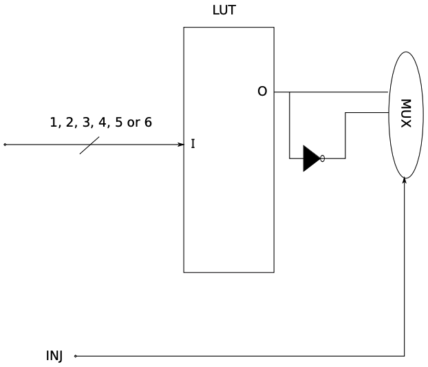

MODify NETlist: A tool for processing verilog netlists and inserting fault injections at RTL level.
===================================================================================================
.. image:: https://img.shields.io/pypi/v/mod-net.svg
    :target: https://pypi.org/project/mod-net/
.. image:: https://img.shields.io/pypi/pyversions/mod-net.svg
    :target: https://pypi.org/project/mod-net/
.. image:: https://circleci.com/gh/LCSR-lab/MODNET.svg?style=shield
   :target: https://circleci.com/gh/LCSR-lab/MODNET
.. image:: https://coveralls.io/repos/github/LCSR-lab/MODNET/badge.svg?branch=master
   :target: https://coveralls.io/github/LCSR-lab/MODNET?branch=master

   LUT transformation

MODNET is a tool that takes the Netlist of a circuit which it will submit, making changes to the places that are considered sensitive, so that the fault injection possible. The HDL code of the circuit to be submitted is synthesized using the "Synplify Pro" synthesis tool. In this tool you choose for which type of technology you want to synthesize the HDL code, it generates the Netlist in Verilog of the device under test (DUT). The generated Netlist is put in the entry in the MODNET tool (Modify NETlist), developed to automate the process of modification of the Xilinx libraries. Some of the modified components are the FD (flip-flop D) and its different copies (FDC, FDE ... etc) and also the LUTs (Look-Up Table), logic gates and multiplexers are included. The exit MODNET is the modified Netlist with a large number of extra input signals used to inject the flaws into the logs and logic gates, in this way It is possible to prepare an RTL so that SEUs and SETs can be injected. In this sense the original internal architecture is not changed and is respected as it is.

Main Features
-------------

* Simple implementation to create SEU and SET injections in Synplify Pro/Premier verilog netlists
* Easly extendible for other netlists sources (Vivado, Yosys, etc.)
* Thought from the begining to be automated into pipelines (fault-injection as a service)

Installing
----------
    
Install using pip:

.. code-block:: python

    pip install mod-net

Creating injections
--------------------
cd into a directory where MODNET can find the Nestlist that will be modified with the desired injections, then run the following command:

.. code-block:: text

    $ modnet --netlist path/to/netlist.vm --top-module top_module --outdir path/to/save/output

These 3 options are those required by the software to interpret the netlist correctly. This settings are:

* `netlist`: The path where to find the netlist to make changes to (as of today, only hierarchical netlists from Synplify Pro are supported)
* `top_module`: This is the module that acts as top for the hole system. Since MODNET interpretates the netlist recursively, it is necessary to indicate which module acts as the top module.
* `outdir`: This is the path where to save the resulting modules with injections (defaults to path/to/netlist/output) 

This will create two directories in your current directory. As an example my directory will be called `example`.

Let’s look at what MODNET created:

::

    example/
    ├── netlist.vm
    └─ output
    │   ├── module1_with_inj.v
    │   ├── module2_with_inj.v
    │   ├── module3_with_inj.v
    │   ├── module4_with_inj.v
    │   ├── module5_with_inj.v
    │   └── module6_with_inj.v
    └── src
        ├── module1.v
        ├── module2.v
        ├── module3.v
        ├── module4.v
        ├── module5.v
        └── module6.v

These files are:

* The outer example/ root directory is a container for your project. Its name doesn’t matter to MODNET; you can rename it anytime you like.
* The inner output/ directory modified modules will be placed.
* The inner src/ directory original modules will be placed.

Develpment
----------
In case you are looking to extend or improve this project, you'll first need to setup your development workflow. The project works with Docker and docker-compose. You can find information about `Install docker <https://docs.docker.com/install/>`_ and `Install docker compose <https://docs.docker.com/compose/install/>`_ in the official documentation.

In the project root directory, run:

.. code-block:: text

    $ docker-compose up

For the first time the docker image will be built. The compose configuration mounts the volume for the python library itself, so any chances made in the code, will be automatically mounted in the Docker container.

Testing 
-------
This project counts with a set of unit tests made with `pytest <https://docs.pytest.org/en/stable/>`_. To run the complete set of sets run the following command:

.. code-block:: bash

    $ docker-compose run tests

This will lunch a new Docker container that runs the run_tests.sh script, which installs the necessary requirements for the tests to run.